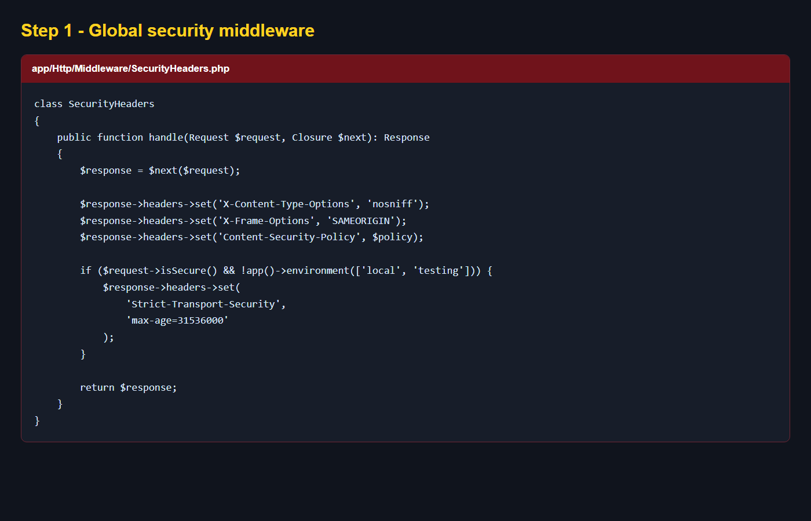
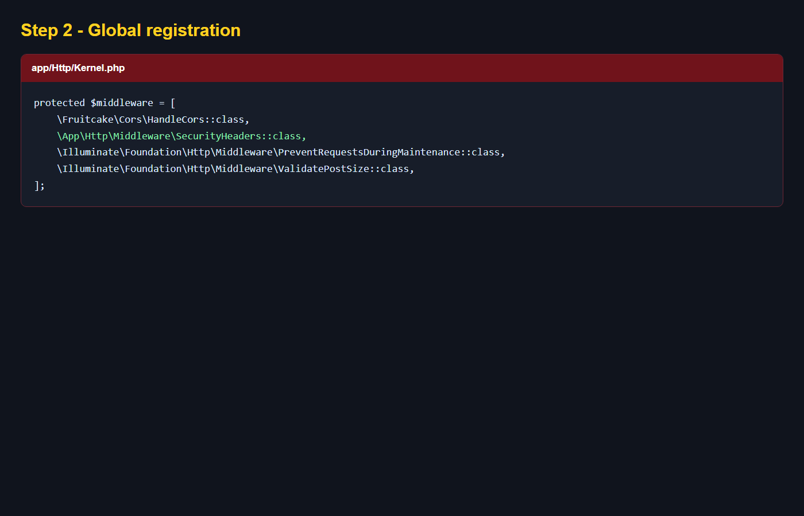
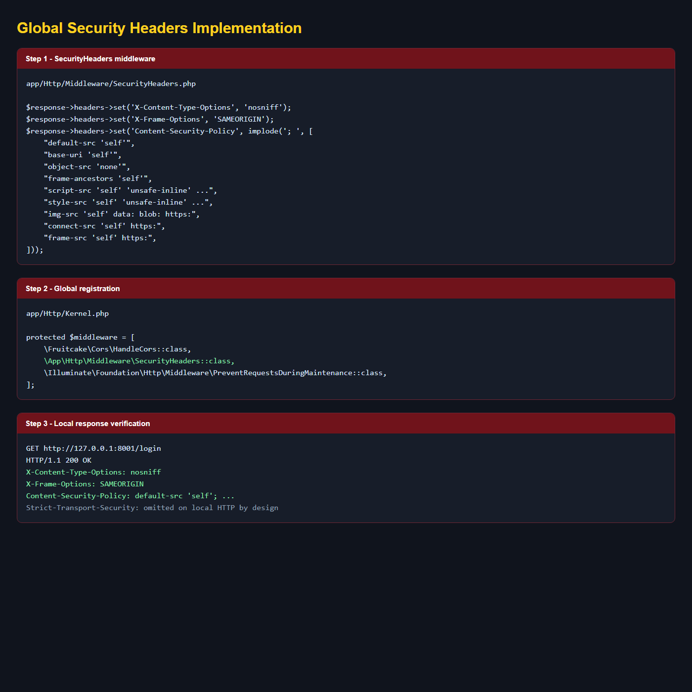
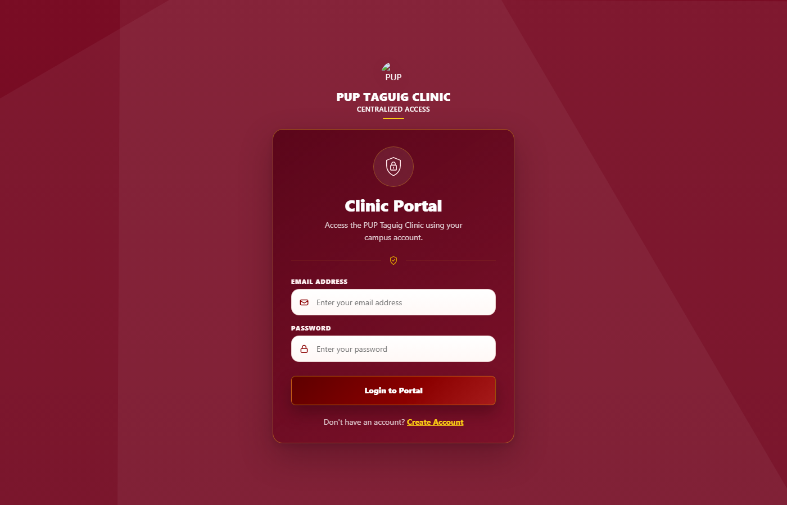

# Security Headers Implementation

## Overview

The clinic CMS now applies the following security headers through one global Laravel middleware:

| Header | Purpose | Current behavior |
| --- | --- | --- |
| `Strict-Transport-Security` | Forces browsers to use HTTPS after a secure visit. | Added only for HTTPS requests outside local/testing environments. |
| `Content-Security-Policy` | Limits where scripts, styles, fonts, images, connections, and frames may load from. | Applied to every response using the current application dependencies. |
| `X-Content-Type-Options` | Prevents MIME-type sniffing. | `nosniff` on every response. |
| `X-Frame-Options` | Helps prevent clickjacking by controlling framing. | `SAMEORIGIN` on every response. |

## Step 1: Create the global middleware

The middleware is located at:

`app/Http/Middleware/SecurityHeaders.php`

It receives the response after the controller finishes, then adds the security headers before returning the response to the browser.



The middleware sets:

```php
$response->headers->set('X-Content-Type-Options', 'nosniff');
$response->headers->set('X-Frame-Options', 'SAMEORIGIN');
$response->headers->set('Content-Security-Policy', $policy);
```

HSTS is conditional:

```php
if ($request->isSecure() && !app()->environment(['local', 'testing'])) {
    $response->headers->set(
        'Strict-Transport-Security',
        'max-age=31536000'
    );
}
```

This prevents local HTTP development from receiving an HSTS instruction. HSTS should only be sent after the application is accessed through HTTPS.

## Step 2: Register the middleware globally

The middleware is registered in:

`app/Http/Kernel.php`

```php
protected $middleware = [
    \Fruitcake\Cors\HandleCors::class,
    \App\Http\Middleware\SecurityHeaders::class,
    // Other global middleware...
];
```



Because it is in the global middleware stack, the headers are applied to normal HTML pages, student pages, admin pages, API responses, and file responses without adding a middleware alias to every route.

## Step 3: Configure the Content Security Policy

The policy uses these main rules:

| Directive | Configuration |
| --- | --- |
| `default-src` | Local application origin only. |
| `base-uri` | Local application origin only. |
| `object-src` | Disabled with `none`. |
| `frame-ancestors` | Only the same origin may frame the application. |
| `script-src` | Local scripts plus the external QR, OCR, jQuery, Botpress, and CDN sources already used by the application. |
| `style-src` | Local styles, inline styles already present in Blade views, Google Fonts, Font Awesome, and Bootstrap CDN styles. |
| `font-src` | Local fonts, Google Fonts, Font Awesome, and CDN fonts. |
| `img-src` | Local images, data URLs, blobs, and HTTPS image sources. |
| `connect-src` | Local and HTTPS API connections. |
| `frame-src` | Local and HTTPS document previews. |

The current policy keeps `'unsafe-inline'` temporarily because the existing application contains many inline Blade scripts and styles. A future hardening pass can replace this with CSP nonces or hashes after the inline code is migrated.

## Step 4: Verify the response headers

Start the local Laravel server, then request a public page:

```powershell
php artisan serve --host=127.0.0.1 --port=8001
curl.exe -sS -D - -o NUL http://127.0.0.1:8001/login
```

The local response must contain:

```text
X-Content-Type-Options: nosniff
X-Frame-Options: SAMEORIGIN
Content-Security-Policy: default-src 'self'; ...
```



The protected page remained accessible after the middleware was added:



HSTS is intentionally absent from this local HTTP result. After deployment behind HTTPS, verify that the staging or production response includes:

```text
Strict-Transport-Security: max-age=31536000
```

## Step 5: Deployment notes

1. Deploy `app/Http/Middleware/SecurityHeaders.php`.
2. Deploy the `app/Http/Kernel.php` registration.
3. Clear Laravel caches if the server uses cached configuration or routes:

   ```bash
   php artisan optimize:clear
   ```

4. Restart PHP-FPM/Apache or reload the hosting process if OPcache is enabled.
5. Verify the headers over the real HTTPS staging URL.
6. Check the browser console for CSP violations on the login, student, admin, QR scanner, OCR, and Botpress pages.

## Verification performed

- PHP lint passed for `SecurityHeaders.php` and `Kernel.php`.
- `php artisan route:list --path=student/home` loaded successfully.
- `php artisan view:cache` completed successfully.
- Local `GET /login` returned `X-Content-Type-Options`, `X-Frame-Options`, and `Content-Security-Policy`.
- HSTS was not returned over local HTTP, as intended.
